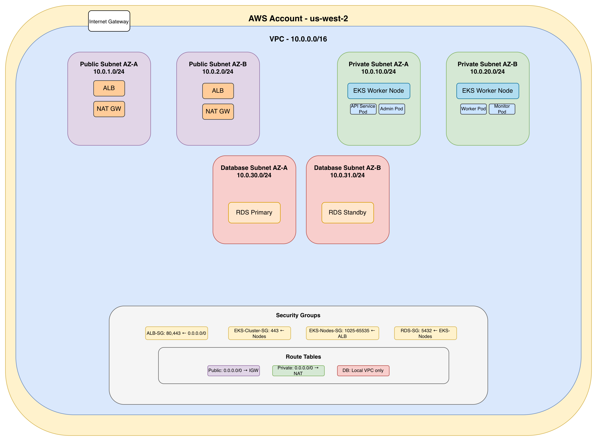
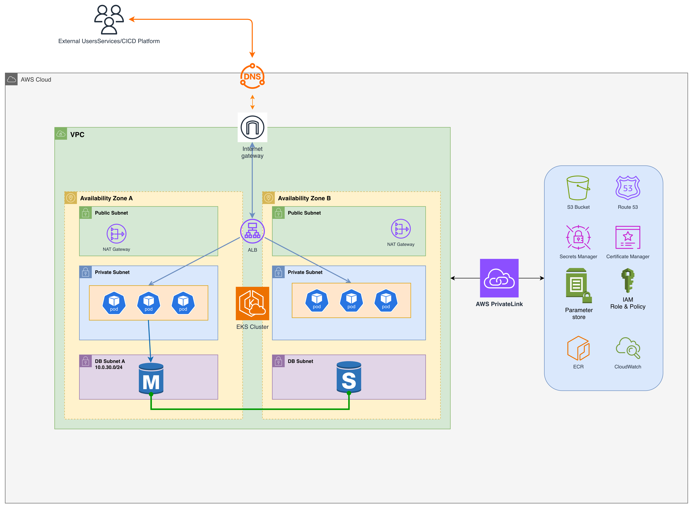
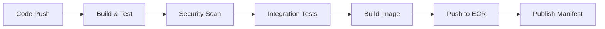
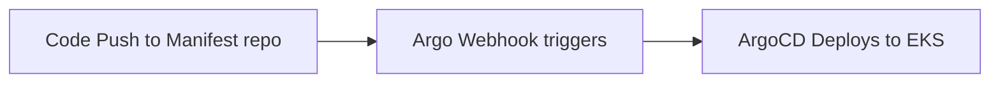

# Flask Application Deployment guide

## Overview
This solution provides a production-ready, enterprise-grade infrastructure for deploying multiple applications across different environments using Kubernetes, Helm, and Terraform. The architecture supports scalable deployment from development to production with consistent patterns and security best practices.

### Note
* This code base has been only tested on Local MiniKiube (DockerDesktop Kubernets) only. 
* Testing was done using dev environment files only. 
* Staging and Prod env file in helmchart, terraform are only for presentation. Those are not thoroughly tested. 


## Table of Contents

1. [How the Code Works](#1-how-the-code-works)
2. [Deployment Guide](#2-deployment-guide)
3. [Design Decisions](#3-design-decisions)
4. [AWS Networking Strategy](#4-aws-networking-strategy)
5. [AWS Services Access Implementation](#5-aws-services-access-implementation)
6. [CI/CD Automation Strategy](#6-cicd-automation-strategy)
7. [Trade-offs and Considerations](#7-trade-offs-and-considerations)
8. [Scalability, Availability, Security & Fault Tolerance](#8-scalability-availability-security--fault-tolerance)
9. [Future Enhancements](#9-future-enhancements)

---

## 1. How the Code Works

### Architecture Components

#### Application Layer (`/app`)
```python
# Simple Flask application with health endpoints
app/
├── app.py              # Flask application with /health endpoint
├── Dockerfile          # Multi-stage build with security hardening
└── requirements.txt    # Minimal dependencies
```

**Key Features:**
- Health check endpoint (`/health`) for Kubernetes probes
- Lightweight Flask application 
- Container-optimized with non-root user
- Multi-stage Docker build for security

#### Infrastructure Layer (`/infra`)

**Helm Charts (`/infra/helmchart`)**
```yaml
helmchart/
├── Chart.yaml                    # Chart metadata and versioning
├── values.yaml                   # Base configuration template
├── values-{env}.yaml             # Environment-specific configurations
└── templates/                    # Kubernetes resource templates
    ├── deployment.yaml           # Multi-application deployments
    ├── service.yaml             # Service definitions
    ├── ingress.yaml             # Ingress controllers
    ├── configmap.yaml           # Configuration management
    ├── secret.yaml              # Secrets management
    ├── hpa.yaml                 # Horizontal Pod Autoscaling
    ├── networkpolicy.yaml       # Network security policies
    └── rbac.yaml               # Role-based access control
```

**Terraform Infrastructure (`/infra/terraform`)**
```hcl
terraform/
├── main.tf                      # Core infrastructure provisioning
├── variables.tf                 # Input variable definitions
├── outputs.tf                   # Output definitions
├── provider.tf                  # Provider configurations
└── environments/
    ├── dev.tfvars              # Development (2 applications)
    ├── staging.tfvars          # Staging (3 applications)
    └── prod.tfvars             # Production (4 applications)
```

### Multi-Application Architecture

The solution uses an **umbrella chart pattern** that can deploy multiple applications with shared infrastructure:

```yaml
# Environment progression
Dev (2 apps):     API + Worker
Staging (3 apps): API + Admin + Worker  
Prod (4 apps):    API + Admin + Worker + Monitoring
```

Each application inherits default configurations but can be individually customized:

```yaml
applications:
  - name: "api-service"
    enabled: true
    image:
      repository: "cloudandparth/my-demo-app"
      tag: "1.0"
    service:
      type: ClusterIP
      port: 80
    autoscaling:
      enabled: true
      minReplicas: 2
      maxReplicas: 10
```

---

## 2. Deployment Guide

### Prerequisites

# Required tools
- Kubernetes cluster (v1.24+) - `I Used Docker Desktop kubernetes for local development`
- Helm 3.8+
- Terraform 1.0+
- kubectl configured for target cluster
- Docker for building images

### Step-by-Step Deployment

#### 2.1 Build and Push Application Image

```bash
# Build the application
cd app/
docker build -t cloudandparth/my-demo-app:1.0 .

# Push to registry (update registry as needed)
docker push cloudandparth/my-demo-app:1.0
```

#### 2.2 Deploy Infrastructure with Terraform

```bash
# Navigate to Terraform directory
cd infra/terraform

# Initialize Terraform
terraform init

# Deploy to development
terraform plan -var-file="environments/dev.tfvars"
terraform apply -var-file="environments/dev.tfvars" -auto-approve

# Deploy to staging
terraform apply -var-file="environments/staging.tfvars" -auto-approve

# Deploy to production  
terraform apply -var-file="environments/prod.tfvars" -auto-approve
```

#### 2.3 Alternative: Direct Helm Deployment

```bash
# Navigate to Helm chart
cd infra/helmchart

# Deploy to development
helm install dev-apps . -f values-dev.yaml

# Deploy to staging
helm install staging-apps . -f values-staging.yaml

# Deploy to production
helm install prod-apps . -f values-prod.yaml
```

### Verification Steps

#### 2.4 Verify Successful Deployment

**Check Terraform Outputs:**

- `terraform output managed_applications` List of deployed applications
- `terraform output access_instructions` How to access applications


**Verify Kubernetes Resources:**
```bash
# Check pods status
kubectl get pods -n my-app-dev
# Should show all pods in "Running" status

# Check services
kubectl get svc -n my-app-dev
# Should show services with appropriate types (NodePort/ClusterIP)

# Check Helm release
helm list -n my-app-dev
# Should show deployed release
```

**Application Health Checks:**
```bash
# Development (NodePort access)
curl http://localhost:30080/health
# Expected: {"status":"healthy"}

# Staging/Production (Port-forward)
kubectl port-forward svc/my-tomorrows-api 8080:80 -n my-app-staging
curl http://localhost:8080/health
# Expected: {"status":"healthy"}
```

**Monitor Application Logs:**
```bash
# View application logs
kubectl logs -l app.kubernetes.io/name=my-tomorrows-api -n my-app-dev

# Follow logs in real-time
kubectl logs -f deployment/my-tomorrows-api -n my-app-dev
```

---

## 3. Design Decisions

### 3.1 Architectural Choices

#### **Umbrella Chart Pattern**
**Decision:** Use a single Helm chart that can deploy multiple applications
**Rationale:**
- **Consistency:** Same deployment patterns across all environments
- **Maintainability:** Single source of truth for Kubernetes resources
- **Scalability:** Easy to add new applications without duplicating infrastructure code
- **Efficiency:** Shared resources and configurations reduce overhead

#### **Environment Progression Strategy**
**Decision:** Gradually increase complexity from dev to production
```
Dev → Staging → Production
2 apps → 3 apps → 4 apps
Simple → Enhanced → Enterprise
```
**Rationale:**
- **Risk Mitigation:** Test features in simpler environments first
- **Resource Optimization:** Development doesn't need full production complexity
- **Cost Management:** Pay for complexity only when needed

#### **Infrastructure as Code (IaC)**
**Decision:** Use Terraform for infrastructure provisioning
**Rationale:**
- **Version Control:** Infrastructure changes are tracked and reviewable
- **Reproducibility:** Identical infrastructure across environments
- **Automation:** Programmatic infrastructure management
- **State Management:** Terraform maintains resource state

### 3.2 Technology Stack Decisions

#### **Kubernetes over Docker Swarm/ECS**
**Rationale:**
- **Industry Standard:** Widely adopted with extensive ecosystem
- **Flexibility:** Vendor-agnostic, can run on any cloud or on-premises
- **Advanced Features:** Rich networking, security, and scaling capabilities
- **Community Support:** Large community and extensive documentation

#### **Helm for Application Deployment**
**Rationale:**
- **Templating:** Dynamic configuration management
- **Package Management:** Application lifecycle management
- **Release Management:** Rollback and upgrade capabilities
- **Community Charts:** Leverage existing chart ecosystem

---

## 4. AWS Networking Strategy

### 4.1 Production-Ready AWS Architecture

#### AWS Networking Aproach

**Network Architecture Diagram:**


**Key Networking Features:**
- **Multi-AZ VPC Design**: High availability across two availability zones
- **Three-Tier Architecture**: Public, private, and database subnet isolation
- **Secure Internet Access**: NAT Gateways for outbound private subnet connectivity
- **Load Balancing**: Application Load Balancer with SSL termination

#### AWS Infrastructure diagram

**AWS Infrastructure Architecture:**


**Complete Infrastructure Overview:**
- **Compute**: EKS cluster with managed control plane and worker nodes
- **Storage**: RDS PostgreSQL, S3 buckets, and EBS volumes
- **Security**: IAM roles, Secrets Manager, Privatelink and certificate management
- **Monitoring**: CloudWatch logging and metrics collection
- **CI/CD**: GitHub Actions integration with Terraform and Helm


### 4.2 Network Components

#### **VPC Configuration**

**Core VPC Setup:**
- **CIDR Block**: `10.0.0.0/16` providing 65,536 IP addresses for scalable growth
- **DNS Configuration**: Hostnames and DNS support enabled for service discovery
- **EKS Integration**: Tagged for Kubernetes cluster resource sharing
- **Multi-AZ Design**: Spans multiple availability zones for high availability

**Public Subnets (10.0.1.0/24, 10.0.2.0/24):**
- **Purpose**: Host ALB (Application Load Balancer) and NAT Gateway
- **Internet Access**: Direct internet connectivity with public IP assignment
- **Load Balancer Role**: Tagged for external load balancer placement
- **High Availability**: Deployed across two availability zones

**Private Subnets (10.0.10.0/24, 10.0.20.0/24):**
- **Purpose**: Host EKS worker nodes and application pods
- **Security**: No direct internet access, traffic routed through NAT Gateway
- **Internal Load Balancer**: Tagged for internal service load balancing
- **Isolation**: Provides secure environment for application workloads

**Database Subnets (10.0.30.0/24, 10.0.31.0/24):**
- **Purpose**: Dedicated subnets for RDS database instances
- **Security**: Completely isolated from public internet
- **High Availability**: Multi-AZ database deployment support
- **Compliance**: Separate network tier for data protection

#### **Security Groups Strategy**

**ALB (Application Load Balancer) Security Group:**
- **Inbound Rules**: HTTP (80) and HTTPS (443) from anywhere (0.0.0.0/0)
- **Purpose**: Public-facing load balancer accepting web traffic
- **SSL Termination**: Handles TLS encryption/decryption at the edge
- **Outbound Rules**: All traffic allowed for backend communication

**EKS Cluster Control Plane Security Group:**
- **Inbound Rules**: HTTPS (443) only from worker node security group
- **Purpose**: Secure communication between control plane and worker nodes
- **API Access**: Kubernetes API server protection with restricted access
- **Outbound Rules**: All traffic for cluster management operations

**EKS Worker Nodes Security Group:**
- **Internal Communication**: All traffic allowed between worker nodes (self-referencing)
- **ALB Integration**: Ports 1025-65535 from ALB security group for service access
- **Node-to-Node**: Unrestricted communication for pod networking and service mesh
- **Outbound Rules**: All traffic for internet access via NAT Gateway

**Security Design Principles:**
- **Least Privilege**: Minimum required permissions for each component
- **Defense in Depth**: Multiple security layers with specific rule sets
- **Segmentation**: Network isolation between different application tiers
- **Monitoring Ready**: Security group rules support traffic flow analysis

### 4.3 Ingress and Load Balancing

#### **AWS Load Balancer Controller Configuration**
```yaml
# kubernetes/alb-ingress.yaml
apiVersion: networking.k8s.io/v1
kind: Ingress
metadata:
  name: my-app-ingress
  annotations:
    kubernetes.io/ingress.class: alb
    alb.ingress.kubernetes.io/scheme: internet-facing
    alb.ingress.kubernetes.io/target-type: ip
    alb.ingress.kubernetes.io/certificate-arn: arn:aws:acm:region:account:certificate/cert-id
    alb.ingress.kubernetes.io/ssl-redirect: '443'
    alb.ingress.kubernetes.io/healthcheck-path: /health
    alb.ingress.kubernetes.io/healthcheck-interval-seconds: '30'
    alb.ingress.kubernetes.io/healthcheck-timeout-seconds: '5'
spec:
  rules:
  - host: api.mytomorrows.com
    http:
      paths:
      - path: /
        pathType: Prefix
        backend:
          service:
            name: my-tomorrows-api
            port:
              number: 80
  - host: admin.mytomorrows.com
    http:
      paths:
      - path: /
        pathType: Prefix
        backend:
          service:
            name: my-tomorrows-admin
            port:
              number: 80
```

---

## 5. AWS Services Access Implementation

### 5.1 IAM Roles for Service Accounts (IRSA)

#### **EKS Service Account with IAM Role**

**IAM Role Configuration:**
- **Role Name**: `my-app-eks-pod-role` with OpenID Connect trust policy
- **Trust Relationship**: Allows EKS pods to assume the role using Web Identity Federation
- **Service Account Binding**: Specifically bound to `my-app-serviceaccount` in production namespace
- **Authentication Method**: Uses OIDC provider for secure, temporary credential access

**AWS Services Access Policies:**

**S3 Storage Access:**
- **Permissions**: Get, Put, Delete objects and List bucket contents
- **Resource Scope**: Limited to `my-app-bucket` and its objects
- **Use Cases**: Application file storage, backup, and data processing
- **Security**: Principle of least privilege with bucket-specific access

**Secrets Manager Integration:**
- **Permissions**: GetSecretValue and DescribeSecret operations
- **Resource Scope**: All secrets under `/my-app/*` path
- **Use Cases**: Database credentials, API keys, and sensitive configuration
- **Rotation Support**: Compatible with automatic secret rotation

**Parameter Store Access:**
- **Permissions**: Get individual parameters and parameter hierarchies
- **Resource Scope**: Parameters under `/my-app/*` path
- **Use Cases**: Non-sensitive configuration, feature flags, and environment settings
- **Cost Optimization**: Free tier usage for standard parameters

#### **Kubernetes Service Account Configuration**
```yaml
# kubernetes/serviceaccount.yaml
apiVersion: v1
kind: ServiceAccount
metadata:
  name: my-app-serviceaccount
  namespace: my-app-prod
  annotations:
    eks.amazonaws.com/role-arn: arn:aws:iam::ACCOUNT:role/my-app-eks-pod-role
```

### 5.2 External Secrets Operator Implementation

#### **External Secrets Controller**
```yaml
# kubernetes/external-secrets.yaml
apiVersion: external-secrets.io/v1beta1
kind: SecretStore
metadata:
  name: aws-secrets-manager
  namespace: my-app-prod
spec:
  provider:
    aws:
      service: SecretsManager
      region: us-west-2
      auth:
        jwt:
          serviceAccountRef:
            name: my-app-serviceaccount

---
apiVersion: external-secrets.io/v1beta1
kind: ExternalSecret
metadata:
  name: database-credentials
  namespace: my-app-prod
spec:
  refreshInterval: 30s
  secretStoreRef:
    name: aws-secrets-manager
    kind: SecretStore
  target:
    name: database-secret
    creationPolicy: Owner
  data:
  - secretKey: username
    remoteRef:
      key: my-app/database
      property: username
  - secretKey: password
    remoteRef:
      key: my-app/database
      property: password
```

## 6. CI/CD Automation Strategy

### 6.1 GitHub Actions Workflow

#### **Complete CI/CD Pipeline**

**Pipeline Overview:**
### Application CICD flow

---
**CI Flow**

**CD Flow**

---

**Key CI/CD Components:**

**Build & Test Stage:**
- **Multi-language support**: Python, Node.js, Java detection
- **Dependency management**: Automated package installation and caching
- **Unit testing**: Pytest, Jest, JUnit execution with coverage reports
- **Code quality**: SonarQube integration for code analysis
- **Vulnerability scanning**: Snyk for dependency vulnerabilities

**Containerization:**
- **Multi-stage builds**: Optimized Docker images with security scanning
- **Base image updates**: Automated security patches for base images
- **Registry management**: Amazon ECR with lifecycle policies
- **Image signing**: Cosign integration for supply chain security

**Deployment Automation:**
- **Environment promotion**: Dev → Staging → Production pipeline
- **Rollback capabilities**: Automated rollback on deployment failures
- **Blue-green deployments**: Zero-downtime production deployments
- **Canary releases**: Gradual traffic shifting for risk mitigation

**Monitoring & Validation:**
- **Health checks**: Comprehensive application and infrastructure monitoring
- **Performance testing**: Load testing with JMeter in staging
- **Security compliance**: OWASP ZAP security testing
- **Notification system**: Slack/Teams integration for deployment status

### 6.2 Environment-Specific Configurations

#### **Branch-Based Deployment Strategy**
```
Branch Mapping:
├── feature-* → No automatic deployment (manual review)
├── develop   → Auto-deploy to dev environment
├── main      → Auto-deploy to dev → staging
├── release-*   → Auto-deploy to → Production
└── hotfix/*  → Fast-track to production with approval
```

### 6.3 GitOps Implementation with ArgoCD

#### **ArgoCD Application Configuration**
```yaml
# argocd/applications/my-app-dev.yaml
apiVersion: argoproj.io/v1alpha1
kind: Application
metadata:
  name: my-app-dev
  namespace: argocd
spec:
  project: default
  source:
    repoURL: https://github.com/pmewada-nubeninja/MyTomorrows-assignment
    targetRevision: HEAD
    path: infra/helmchart
    helm:
      valueFiles:
        - values-dev.yaml
  destination:
    server: https://kubernetes.default.svc
    namespace: my-app-dev
  syncPolicy:
    automated:
      prune: true
      selfHeal: true
    syncOptions:
      - CreateNamespace=true
```

---

## 7. Trade-offs and Considerations

### 7.1 Architectural Trade-offs

#### **Umbrella Chart vs Individual Charts**

**Decision:** Use umbrella chart pattern
**Pros:**
- ✅ **Consistency:** Same deployment patterns across applications
- ✅ **Efficiency:** Shared infrastructure and configuration
- ✅ **Maintainability:** Single source of truth
- ✅ **Resource Optimization:** Shared services and policies

**Cons:**
- ❌ **Coupling:** Applications share lifecycle (deploy/update together)
- ❌ **Complexity:** More complex chart structure
- ❌ **Flexibility:** Harder to have completely different configurations per app

**Mitigation Strategies:**
- Individual application enable/disable flags
- Per-application configuration overrides
- Conditional resource deployment based on application requirements

#### **Multi-Environment Strategy**

**Decision:** Progressive complexity (2→3→4 apps)
**Pros:**
- ✅ **Risk Management:** Test features in simpler environments first
- ✅ **Cost Optimization:** Pay for complexity only when needed
- ✅ **Learning Curve:** Gradual complexity introduction

**Cons:**
- ❌ **Environment Drift:** Potential differences between environments
- ❌ **Testing Gaps:** Production features not tested in lower environments
- ❌ **Complexity Management:** Different configurations to maintain

**Mitigation Strategies:**
- Standardized base configurations with environment overlays
- Feature flags to enable/disable functionality per environment
- Comprehensive integration testing in staging

### 7.2 Technology Trade-offs

#### **Terraform vs CloudFormation vs CDK**

**Decision:** Terraform
**Pros:**
- ✅ **Multi-Cloud:** Vendor-agnostic infrastructure provisioning
- ✅ **Mature Ecosystem:** Large community and module library
- ✅ **State Management:** Built-in state tracking and locking
- ✅ **Plan/Apply:** Preview changes before execution

**Cons:**
- ❌ **State Management Complexity:** Remote state storage and locking required
- ❌ **Learning Curve:** HCL syntax and Terraform concepts
- ❌ **Version Management:** Provider and module version compatibility

#### **Helm vs Kustomize vs Plain YAML**

**Decision:** Helm with Kustomize patterns
**Pros:**
- ✅ **Templating:** Dynamic configuration management
- ✅ **Package Management:** Release management and rollback
- ✅ **Ecosystem:** Large chart repository and community

**Cons:**
- ❌ **Complexity:** Template syntax and debugging challenges
- ❌ **Learning Curve:** Helm-specific concepts and patterns
- ❌ **Template Logic:** Complex conditional logic in templates

### 7.3 Operational Trade-offs

#### **Self-Managed vs Managed Services**

**Decision:** Hybrid approach
**Self-Managed Components:**
- Kubernetes applications and configurations
- Custom monitoring and alerting
- Application-specific security policies

**Managed Services:**
- EKS for Kubernetes control plane
- RDS for database management
- ALB for load balancing
- CloudWatch for infrastructure monitoring

**Rationale:**
- **Balance:** Control where needed, managed services for operational overhead
- **Expertise:** Focus team expertise on application logic vs infrastructure management
- **Reliability:** Leverage AWS operational excellence for foundational services

---

## 8. Scalability, Availability, Security & Fault Tolerance

### 8.1 Scalability

#### **Horizontal Pod Autoscaling (HPA)**
```yaml
apiVersion: autoscaling/v2
kind: HorizontalPodAutoscaler
metadata:
  name: my-tomorrows-api-hpa
  namespace: my-app-prod
spec:
  scaleTargetRef:
    apiVersion: apps/v1
    kind: Deployment
    name: my-tomorrows-api
  minReplicas: 3
  maxReplicas: 20
  metrics:
  - type: Resource
    resource:
      name: cpu
      target:
        type: Utilization
        averageUtilization: 70
  - type: Resource
    resource:
      name: memory
      target:
        type: Utilization
        averageUtilization: 80
  behavior:
    scaleDown:
      stabilizationWindowSeconds: 300
      policies:
      - type: Percent
        value: 10
        periodSeconds: 60
    scaleUp:
      stabilizationWindowSeconds: 60
      policies:
      - type: Percent
        value: 50
        periodSeconds: 60
```

#### **Vertical Pod Autoscaling (VPA)**
```yaml
apiVersion: autoscaling.k8s.io/v1
kind: VerticalPodAutoscaler
metadata:
  name: my-tomorrows-api-vpa
  namespace: my-app-prod
spec:
  targetRef:
    apiVersion: apps/v1
    kind: Deployment
    name: my-tomorrows-api
  updatePolicy:
    updateMode: "Auto"
  resourcePolicy:
    containerPolicies:
    - containerName: my-tomorrows-api
      maxAllowed:
        cpu: 2
        memory: 4Gi
      minAllowed:
        cpu: 100m
        memory: 128Mi
```


### 8.2 High Availability

#### **Multi-AZ Deployment Strategy**
```yaml
# Node Affinity for AZ Distribution
affinity:
  podAntiAffinity:
    preferredDuringSchedulingIgnoredDuringExecution:
    - weight: 100
      podAffinityTerm:
        labelSelector:
          matchExpressions:
          - key: app.kubernetes.io/name
            operator: In
            values:
            - my-tomorrows-api
        topologyKey: topology.kubernetes.io/zone
```

#### **Pod Disruption Budgets**
```yaml
apiVersion: policy/v1
kind: PodDisruptionBudget
metadata:
  name: my-tomorrows-api-pdb
  namespace: my-app-prod
spec:
  minAvailable: 2
  selector:
    matchLabels:
      app.kubernetes.io/name: my-tomorrows-api
```

#### **Health Checks and Probes**
```yaml
livenessProbe:
  httpGet:
    path: /health
    port: 5000
  initialDelaySeconds: 30
  periodSeconds: 10
  failureThreshold: 3

readinessProbe:
  httpGet:
    path: /ready
    port: 5000
  initialDelaySeconds: 5
  periodSeconds: 5
  failureThreshold: 3

startupProbe:
  httpGet:
    path: /startup
    port: 5000
  initialDelaySeconds: 10
  periodSeconds: 10
  failureThreshold: 30  # Allow 5 minutes for startup
```

### 8.3 Security Implementation

#### **Pod Security Standards**
```yaml
apiVersion: v1
kind: Namespace
metadata:
  name: my-app-prod
  labels:
    pod-security.kubernetes.io/enforce: restricted
    pod-security.kubernetes.io/audit: restricted
    pod-security.kubernetes.io/warn: restricted
```

#### **Security Contexts**
```yaml
securityContext:
  runAsNonRoot: true
  runAsUser: 10001
  runAsGroup: 10001
  readOnlyRootFilesystem: true
  allowPrivilegeEscalation: false
  capabilities:
    drop:
    - ALL
  seccompProfile:
    type: RuntimeDefault
```

#### **Secret Management**
```yaml
# External Secrets Integration
apiVersion: external-secrets.io/v1beta1
kind: ExternalSecret
metadata:
  name: app-secrets
  namespace: my-app-prod
spec:
  refreshInterval: 1h
  secretStoreRef:
    name: aws-secrets-manager
    kind: SecretStore
  target:
    name: app-secrets
    creationPolicy: Owner
  data:
  - secretKey: database-url
    remoteRef:
      key: my-app/production/database
      property: url
  - secretKey: api-key
    remoteRef:
      key: my-app/production/api
      property: key
```

## 9. Future Enhancements

### 9.1 Observability and Monitoring

#### **AWS Native Monitoring Solutions**

- Amazon CloudWatch Container Insights
- AWS X-Ray for Distributed Tracing
- Application Performance Monitoring (APM)
- CloudWatch Logs Insights Queries
- Alerting and Incident Management
- CloudWatch Alarms
- AWS SNS Integration for Alerts

#### **Security Monitoring**

- AWS GuardDuty for EKS

- AWS Security Hub Integration

### 9.2 Advanced Security Features

#### **Image Vulnerability Scanning**
- Trivy
- AWS ECR scanning
- Snyk

### 9.3 GitOps and Progressive Deployment

* Making use of ArgoCD for automatic Kubernetes deployment will be first step to enable GitOps.
* Conditional deployment with type of branch or tag will be deployed to Environments. For example `develop` or `feature` deploys only to `dev` environment, `master` branch to Staging and Release branch or tag to Pre-Prod and Prod environment. 

### 9.4 Cost Optimization

**Integration of AWS Native cost optimization tools**
- AWS Cost Explorer Integration
- Kubernetes Resource Monitoring


Aditionally on EKS level we can optimize by 

#### **Resource Right-Sizing with VPA**
```yaml
# optimization/vpa-recommender.yaml
apiVersion: autoscaling.k8s.io/v1
kind: VerticalPodAutoscaler
metadata:
  name: my-tomorrows-api-vpa
  namespace: my-app-prod
spec:
  targetRef:
    apiVersion: apps/v1
    kind: Deployment
    name: my-tomorrows-api
  updatePolicy:
    updateMode: "Off"  # Recommendation only
  resourcePolicy:
    containerPolicies:
    - containerName: my-tomorrows-api
      maxAllowed:
        cpu: 2
        memory: 4Gi
      minAllowed:
        cpu: 50m
        memory: 64Mi
      controlledResources: ["cpu", "memory"]
```

#### **Pod Priority and Preemption**
```yaml
# optimization/priority-classes.yaml
apiVersion: scheduling.k8s.io/v1
kind: PriorityClass
metadata:
  name: critical-priority
value: 1000
globalDefault: false
description: "Critical priority for production workloads"
---
apiVersion: scheduling.k8s.io/v1
kind: PriorityClass
metadata:
  name: normal-priority
value: 100
globalDefault: true
description: "Normal priority for regular workloads"
---
apiVersion: scheduling.k8s.io/v1
kind: PriorityClass
metadata:
  name: low-priority
value: 10
globalDefault: false
description: "Low priority for batch workloads"
```
---

## Summary

This comprehensive solution provides:

🔸 **Production-Ready Architecture**: Multi-environment deployment with progressive complexity  
🔸 **Security-First Design**: Pod Security Standards, RBAC, Network Policies, and secrets management  
🔸 **Scalability**: Horizontal and vertical autoscaling with cluster autoscaling  
🔸 **High Availability**: Multi-AZ deployment, health checks, and graceful degradation  
🔸 **Fault Tolerance**: Circuit breakers, retry logic, and graceful shutdown  
🔸 **Observability**: Comprehensive monitoring, logging, and distributed tracing  
🔸 **Automation**: Full CI/CD pipeline with GitOps integration  
🔸 **Cost Optimization**: Resource right-sizing and spot instance integration  

The solution balances operational complexity with business requirements, providing a solid foundation for enterprise-grade application deployment while maintaining flexibility for future enhancements and scaling needs.


Creator: @pmewada-nubeninja
